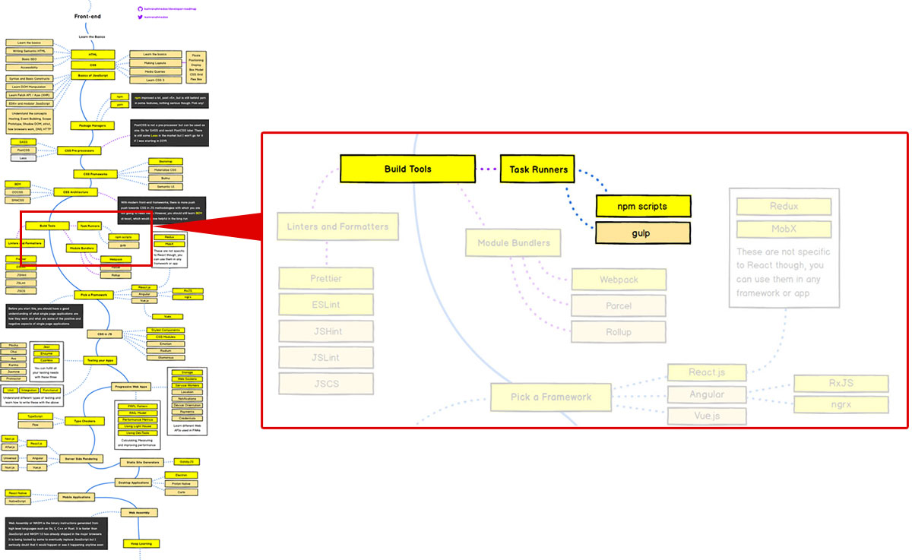

# Introduction

## Overview



(출처: https://github.com/kamranahmedse/developer-roadmap)

현 시점에 Front-End 개발자에게 있어 gulp는 이미 지나간 도구라 해도 전혀 과장이 아닐 겁니다. <br>
해외에서는 이미 grunt, gulp에서 NPM Script로 옮겨가고 있는 상황이기도 합니다.

하지만, Front-End Frameworks나 JavaScript(특히 Node.js 환경에서의)에 대해 높은 허들을 가지고 있거나, 거부감이
있는 웹 퍼블리셔나 웹 디자이너에게 있어는 gulp는 여전히 유용한 생산성 도구가 될 것입니다. <br>
<span style="font-style:italic;font-size:0.75em">(* 하지만 여전히 JavaScript에 대한 최소한의 이해는 필요합니다.)</span>

## What is Gulp?

> 개발 작업 흐름에서 성가시거나 시간이 소비되는 업무를 자동화 해주는 툴킷으로, 빙빙 돌아서 무언가를 만드는 일을
> 멈출 수 있습니다.

출처: [gulp 공식 홈페이지](https://gulpjs.com/)

### What is Task Runner?

task(작업) + runner(수행기)

일련의 작업들을 자동으로 수행하게 해주는 자동화 도구.

즉,

- HTML/CSS/JavaScript 작성 후 저장하고 수동으로 새로고침
- CSS vender prefix 검색 및 적용
- Sass/LESS 컴파일
- 아이콘 이미지 모아서 스프라이트 이미지 만들고 좌표 측정 및 CSS 적용
- 리소스 압축 및 이미지 최적화
- HTML 적합성 검사, CSS/JavaScript 컨벤션 준수 검사
- CSS/JavaScript 파일 합치기
- JavaScript 난독화

등 웹 개발 과정에서 발생되는 일련의 여러가지 작업들을 자동으로 수행할 수 있게 해주는 도구입니다.

### Current Version

2018년 1월 기준으로 Gulp는 현재 4.0.0 버전입니다.

반면, Gulp 사용 방법에 대해 검색을 해보면 대부분이 3.x 버전의 것을 소개하고 있고, 해당 버전의 것은 더 이상 추천되지
않은 방법이기 때문에 실습은 4.0.0 버전의 내용을 기준으로 진행됩니다.

## Prepare

- 실습을 위해 github의 코드를 내려받으세요.

  ```bash
  $ git clone -b scaffold --single-branch --depth=1 https://github.com/mulder21c/gulp-study.git /your/practice/path
  ```

  > `/your/practice/path`는 연습할 디렉토리로 설정하시면 됩니다. <br> 실습 자료에서는 `/gulp-playground`로 설명됩니다.

### `scaffold` file structure

```
./gulp-playground
  └── source
        ├── css
        │     └── index.css
        ├── images
        ├── js
        │     └── common.js
        ├── sass
        │     └── main.scss
        └── index.html
```
