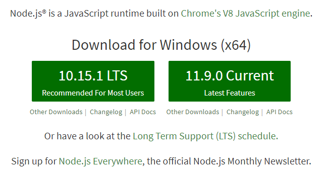

# Installing Gulp

## Install Node.js & NPM

Gulp를 설치하고 사용하려면 Node.js와 NPM(Node Package Manager)을 설치해야 합니다.

Node.js와 NPM을 설치하기 위해서는 [https://nodejs.org](https://nodejs.org)에서 다운로드 받아 설치합니다. <br>
(NPM은 Node.js를 설치하면 자동으로 설치됩니다.)



### Verifying that Node.js & NPM was properly installed

Node.js와 NPM이 설치 되었는지 확인하려면 다음과 같이 설치된 Node.js, NPM의 버전을 확인해보면 됩니다.

```bash
$ node --version
v10.13.0
```

```bash
$ npm --version
6.4.1
```

## Install gulp-cli

`gulp` 명령을 사용하려면 gulp-cli를 설치 해야 합니다.

설치는 터미널을 열고 다음 명령을 입력하기만 하면 됩니다.

```bash
$ npm install --global gulp-cli
```

Mac 사용자의 경우는 global 설치를 위해 관리자 권한을 얻어야 설치가 가능하므로 아래와 같이
`sudo` 를 붙여서 명령을 입력해야 합니다.

```bash
$ sudo npm install --global gulp-cli
```

> `--global`: 이 옵션은 NPM 패키지를 시스템 전역으로 설치하겠다는 옵션입니다.